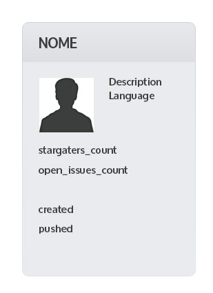

# Teste Escale

Teste requerido pela Escale para avaliação de habilidades.

## Instalação

* Clone o repositório
* `npm install`

### Rodando localmente

* `npm run serve` ou `gulp serve`

### Rodando para produção

* Fazendo build apenas: `npm run build` ou `gulp build`
* Rodando servidor local com esse build: `npm run serve:dist` ou `gulp serve:dist`

## Funcionalidades

* Exibir uma lista de cards com todos os repositórios que `user` deu `star`;
* Ordenar alfabeticamente pelo nome do repositório, quantidade de stars e open issues via Select;
* Filtrar por linguagem (ex: repos em JavaScript)
* `user` = `wilfernandesjr`

## Texto na íntegra:

```
Gostaria de exibir uma lista de cards com todos os  repositorios que eu dei star.
Para isso use a API do GH e liste todos os repos do meu usuario(wilfernandesjr) que eu dei star.
Na página eu gostaria de um select para ordenar alfabeticamente pelo nome do repositorio ou pela quantidade de stars e open issues
Gostaria tb de um filtro por linguaguem(ex: exibir somente repos de javascript)

Lembre-se:
- descrever no README como eu faço pra rodar local;
- URL caso tenha feito o deploy em algum PaaS;
- qq outra informação que julgar necessario;
```


